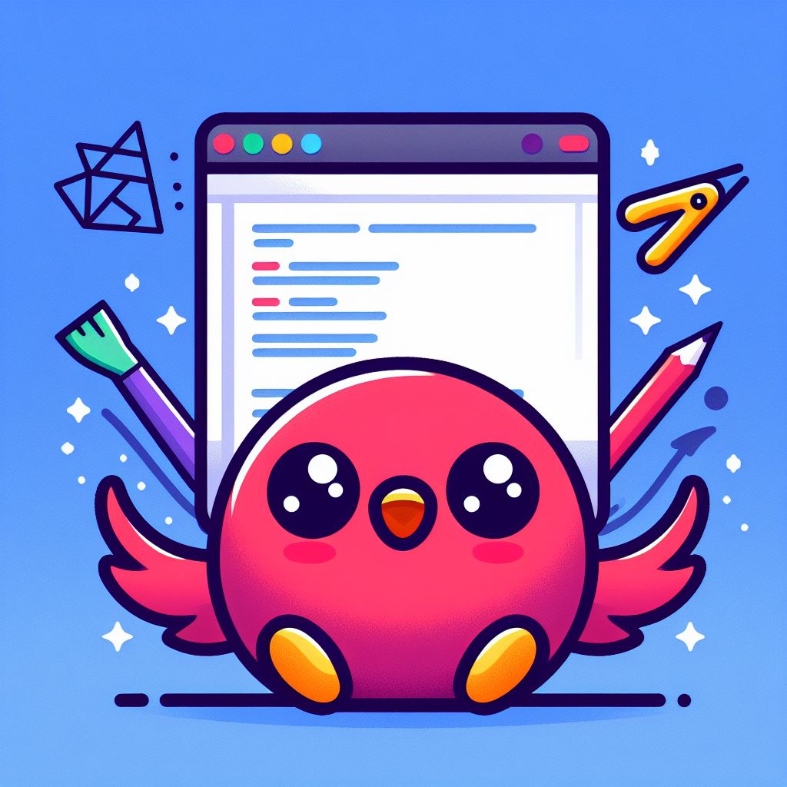

<!--<br>


    &nbsp;&nbsp;&nbsp;&nbsp;
     <a href="https://www.github.com/soko9/readme_creator/"></a> -->

<br>

# Flutter Web Page for Creating Markdown Files

### A Flutter web application that allows users to easily create README files by dragging and dropping Markdown elements onto a canvas.

<br>

## Features

- **Drag-and-Drop Interface:** Intuitive UI for adding Markdown elements to the canvas.
- **Dynamic Dialogs:** Informational dialogs for users to fill out when adding Markdown elements.
- **Reorderable Canvas:** Easily rearrange the order of Markdown elements on the canvas.
- **Clear Canvas:** Remove all items from the canvas with a single click.
- **Export to README.md:** Save the list of Markdown elements as a README.md file.

<br>

## Demo


<br>

## Getting Started

### You can visit the webpage [here](https://readme-creator.netlify.app)

### OR

### Clone the repository:

   ```bash
   git clone https://github.com/your-username/your-repo.git
   ```

### Navigate to the project directory:

   ```bash
   cd your-repo
   ```

### Install dependencies:

   ```bash
   flutter pub get
   ```

### Run the application:

   ```bash
   flutter run -d web
   ```
<br>

## Usage

1. Open the web page in your browser.
2. Drag and drop Markdown elements from the toolbar to the canvas.
3. Fill out the information in the dialog that appears.
4. Reorder or remove elements as needed.
5. Click the "Export" button to generate the README.md file.

<br>

## Acknowledgments

### Packages used:
|package|version|
|:---|---:|
|[provider](https://www.pub.dev/packages/provider)|`6.1.1`|
|[url_launcher](https://www.pub.dev/packages/url_launcher)|`6.2.1`| 

### Font used: [Jetbrains Mono](https://www.jetbrains.com/lp/mono/)

<br>

## Future enhancements

- Implement multiple **color schemes** along with **dark theme**
- Fixing **inputs focusing** for seamless user experience
- Implementing a good **color picker** for badge color input
- Adding more **badges**
- Creating **responsive layout** for mobile screens

<br>

## License

#### This project is licensed under the [MIT License](https://mit-license.org/)

<br>

## Contributing
### If you'd like to contribute to this project, please follow these steps:

#### Fork the repository.
#### Create a new branch for your feature or bug fix.
#### Make your changes and submit a pull request.
